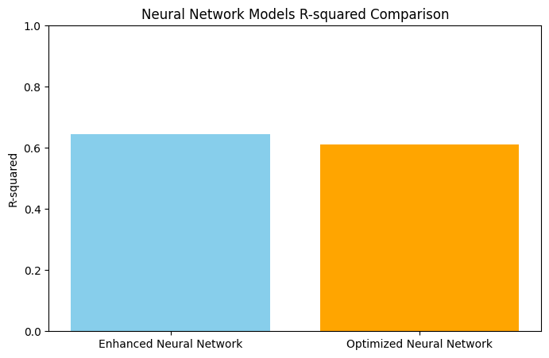
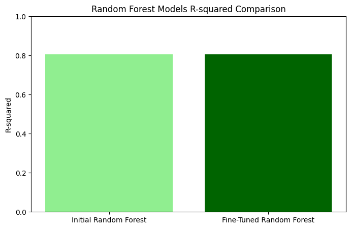
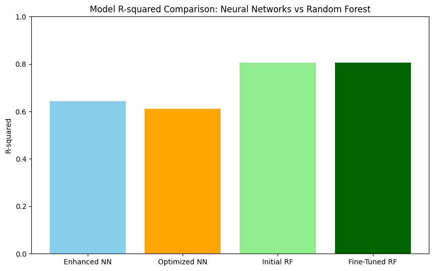

# __Building Machine Learning Models for Apartment Rental Price Prediction__

### __Project 4: Chinna Maijala, Kimberly Her, Yara El-Emam, and Zane Huttinga__

## Description
We analyzed the Apartments for Rent dataset, sourced from the USA classifieds on the UCI Machine Learning Repository. Our objective is to leverage machine learning techniques, including Linear Regression, Neural Networks, and Random Forest, to evaluate model performance and build predictive models that can be applied for future rental price predictions. The project also utilized Apache Spark for initial data handling and exploration, efficiently loading and processing the raw dataset before transitioning to Pandas for in-depth analysis and machine learning workflows.

## Link to Data Set from UCI Machine Learning Repository 
https://archive.ics.uci.edu/dataset/555/apartment+for+rent+classified 

## Folders/Files
- CSV Output Files: Includes the cleaned version of the data set, "apartments_data_cleaned.csv" and the model results that were exported from the code.
- Google Colab: Includes Google Colab notebook file. 
- Resources: Includes the original data set, "apartments_for_rent_classified_100K.7z" that was downloaded directly from the UCI Machine Learning Repository. 
- Visuals: Contains model result graphs/visualizations.
- "Building Machine Learning Models for Apartment Rental Price Prediction" Presentation (please download to view). 
- ReadMe

## Visuals
### Neural Network Results

__Enhanced Neural Network:__
Achieved an R-squared of 0.6444.
Featured regularization techniques such as dropout and batch normalization.
Fell short of the required threshold of 0.80.

__Optimized Neural Network:__
Achieved an R-squared of 0.6117.
Additional regularization and learning rate adjustments were applied.
Despite optimization, it showed slightly lower performance compared to the Enhanced Neural Network.

### Random Forest Results

__Initial Random Forest:__
The Initial Random Forest Run demonstrated R-squared: 80.49%, showcasing excellent performance with minimal tuning.

__Fine-tuning Random Forest:__
Fine-tuning through manual hyperparameter optimization slightly improved the performance to R-squared: 80.53%, confirming the model's robustness on enriched data.
Random Forest's ability to handle nonlinear relationships and feature interactions contributed significantly to its success.

### Model R-Squared Comparison: Neural Networks vs Random Forest

__Key Factors in Achieving High Performance:__

- Data Enrichment: Adding detailed features (e.g., amenities and geographical data) allowed the models to leverage more meaningful patterns.
Feature Engineering: One-hot encoding and other transformations enhanced the dataset's utility for machine learning models.
- Hyperparameter Tuning: Both manual and automated fine-tuning approaches demonstrated how small adjustments could optimize model performance.

### Conclusion
In conclusion, our results emphasize the importance of data enrichment and optimization in enhancing machine learning performance. By filling missing geographic information, encoding amenities, and ensuring data consistency, we enhanced the dataset to generate meaningful insights for predicting apartment rental prices. As a result, our fine-tuned Random Forest model achieved an R-squared of over 80%, highlighting its strong predictive accuracy.

## Installation
To run the code in Google Colab, start by creating or opening a notebook on the platform. Install any required libraries using `pip install` or `apt-get install`. For **Notebook 1** (`apartments_prediction`), upload the main CSV file manually: `apartments_for_rent_classified_100K.csv`. For **Notebook 2** (`apartments_data_enrichment_optimization`), upload the cleaned dataset: `apartments_data_cleaned.csv`. Verify installations by importing the necessary libraries and then execute the code. Save your work to Google Drive or download it locally for future use, as Colab sessions reset when closed.

## Technologies
- **Apache Spark**: For initial data handling and exploration.
- **Pandas**: For in-depth data manipulation and analysis.
- **NumPy**: For numerical computations.
- **Scikit-learn**: For machine learning models and evaluation.
- **Matplotlib**: For visualizations.

## Supplementary Analysis
As part of our exploration, we evaluated additional models to understand their predictive performance. While these models are not incorporated into the main presentation, their results provide valuable insights into alternative machine learning approaches.

### **1. LightGBM**
- **Overview**:
  - LightGBM is an efficient gradient boosting algorithm designed for speed and accuracy, especially with large datasets.
  - It uses histogram-based learning, enabling fast training with sparse features.

- **Results**:
  - **Mean Squared Error (MSE)**: 170,490.74
  - **R-squared**: 0.7439 (74.39%)

### **2. CatBoost**
- **Overview**:
  - CatBoost excels with categorical features and requires minimal preprocessing, making it highly efficient for real-world datasets.
  - It automatically handles categorical data without extensive feature engineering.

- **Results**:
  - **Mean Squared Error (MSE)**: 191,902.68
  - **R-squared**: 0.7118 (71.18%)

### **Insights from Exploration**
- While **LightGBM** achieved better results (R-squared: 74.39%) compared to **CatBoost** (R-squared: 71.18%), both underperformed relative to the **Random Forest** model, which remains the best-performing approach.
- These exploratory results highlight the robustness of Random Forest and its ability to handle nonlinear relationships effectively.
- The additional exploration underscores the importance of experimenting with multiple models to validate performance.

**Note**
Because the Random Forest achieved our desired predictive power, we did not include the results from LightGBM and CatBoost in our analysis. They are, however, possible avenues for future work.

## Roadmap
Although the project is complete, there is always room for improvement. In the future, we may explore optimizing existing features, refining performance, and implementing additional models to enhance the project’s capabilities. While there is no immediate timeline for these updates, we are open to evolving the project and welcome any contributions or suggestions for future enhancements.

## Contributing
We’re always excited to welcome new contributors. If you'd like to help improve this project, feel free to fork the repository and submit a pull request with your changes. Please ensure your contributions follow our coding standards, and include detailed descriptions of your updates. Thank you for helping make this project better!

## Authors and acknowledgment
We want to express our sincere gratitude to all the contributors who have helped bring this project to life. Your collaboration, innovation, and hard work have been instrumental in driving the success of this endeavor. Whether through code, ideas, bug fixes, or feedback, each of you has made a significant impact, and we couldn't have done it without you.

Your enthusiasm and dedication are what make this project thrive. We are incredibly grateful for your time and effort, and we look forward to continuing to grow and evolve this project together.

Thank you for being a part of this journey!

## Project status
We are thrilled to announce that our project has been successfully completed. After extensive work and collaboration, we have achieved all the key milestones and can now proudly share the final product.

A big thank you to everyone involved for your dedication, hard work, and expertise. This project wouldn't have been possible without your contributions, and we truly appreciate the effort you’ve put into every stage.

Though this marks the official completion, we remain open to future enhancements and improvements. We're excited to see the impact of this project and look forward to what lies ahead.

## Footnotes
References and resources: UofM Virtual Data Bootcamp course and we used ChatGPT for assistance when our codes weren't running properly.

# __Thank you for visiting our project!__
